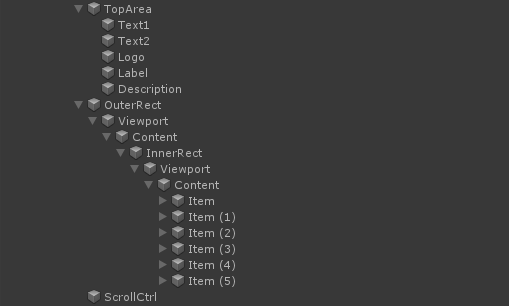
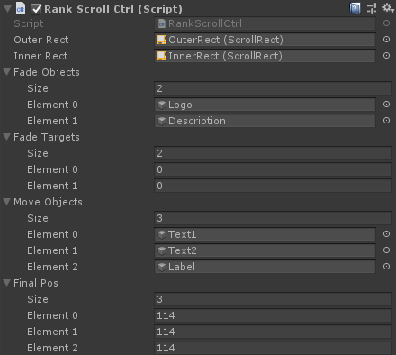

# Nested scroll control

This is a unity component that controls a nested scroll view, the layout is shown below

The outer rect will scroll firstly unless the inner rect has been scrolled to the top, after that the inner start scolling if user continues dragging. Similarly, after the inner rect had been scrolled to the bottom, the outer rect start scrolling.

The top area contains some objects that show above the inner rect, they will move or fade during the movement of inner rect. It is you who determine which object is going to fade or move.

The object ScrollCtrl is where this script mounted, it controls the whole scroll view. Here is how the script shows in the inspector:

This is the work of a beginner. If there is any problem, please correct me.
